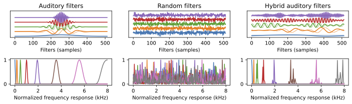

# Stable Hybrid Auditory Filterbanks


> **Hold me Tight: Trainable and stable hybrid auditory filterbanks for speech enhancement**\
> Daniel Haider*, Felix Perfler*, Vincent Lostanlen, Martin Ehler, Peter Balazs\
> **Equal contribution*\
> Paper: https://arxiv.org/abs/2408.17358

## ✨✨NEW✨✨
We release an implementation as a module for easy inclusion in your models at:
https://github.com/danedane-haider/HybrA-Filterbanks


## About

Convolutional layers with 1-D filters are often used as frontend to encode audio signals. Unlike fixed time—frequency representations, they can adapt to the local characteristics of input data.
However, 1-D filters on raw audio are hard to train and often suffer from instabilities.
In this paper, we address these problems with hybrid solutions, i.e., combining theory-driven and data-driven approaches. 
First, we preprocess the audio signals via a auditory filterbank, guaranteeing good frequency localization for the learned encoder.
Second, we use results from frame theory to define an unsupervised learning objective that encourages energy conservation and perfect reconstruction. Third, we adapt mixed compressed spectral norms as learning objectives to the encoder coefficients. 
Using these solutions in a low-complexity encoder—mask—decoder model significantly improves the perceptual evaluation of speech quality (PESQ) in speech enhancement.

## Usage

### Installation

Install the necessary packages with:
```
$ pip install -r requirements.txt
```
### Training

The training script can be started with:
```
$ python main.py
```
The script takes various input arguments with most of them offering default sensible parameter choises. The argument `--dataset` has to be provided and is the path to the dataset as a string. The dataset used was the [CHiME-2 dataset](https://www.chimechallenge.org/challenges/chime2/index). For all other parameters please refer to the help or code.

### Testing

The test script can be executed using:
```
$ python test.py
```
The required arguments are `--dataset`, `--model_file` representing a string to the trained model weight file, and `--result_csv`, which is the file where the results are written to. 

## Citation

If you find our work valuable, please cite

```
@article{HaiderTight2024,
  title={Hold me Tight: Trainable and stable hybrid auditory filterbanks for speech enhancement},
  author={Haider, Daniel and Perfler, Felix and Lostanlen, Vincent and Ehler, Martin and Balazs, Peter},
  journal={arXiv preprint arXiv:2408.17358},
  year={2024}
}
```
